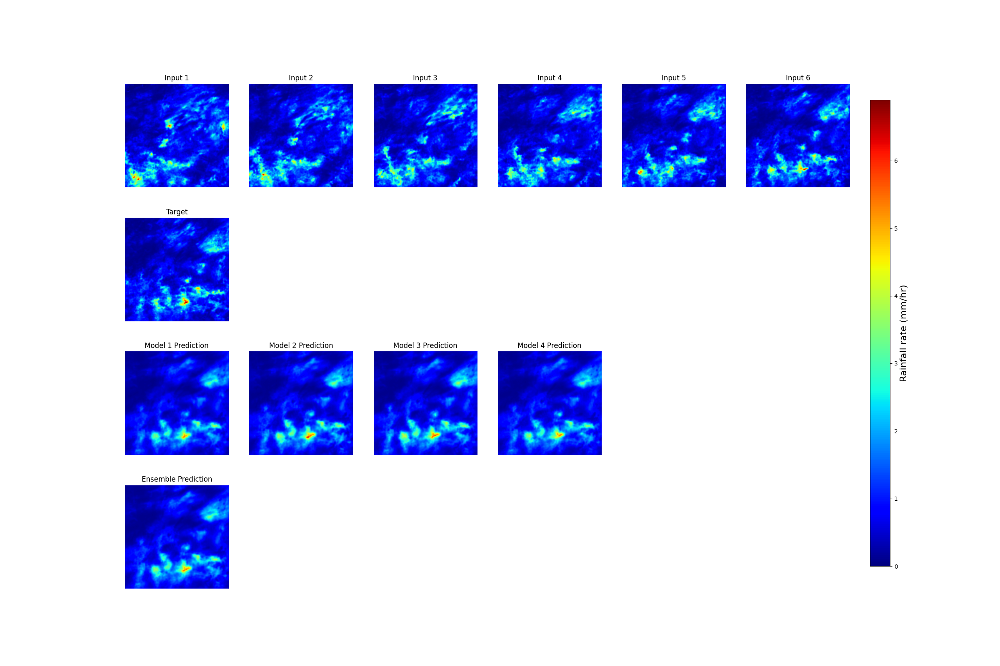

# Precipitation Nowcasting U-Net with HSR Data

This repository contains PyTorch code used for precipitation nowcasting experiments with KMA HSR composite rainfall data and weighted average ensembles.

The work is associated with the paper **"Improving Deep Learning-Based Precipitation Nowcasting Models: Application of Weighted Average Ensemble Methods"**.

## What is included

- U-Net, SE U-Net, Attention U-Net, Dual Attention U-Net, and SAR U-Net model code
- HSR `.tar.gz` extraction and `.bin.gz` to cropped 16-bit PNG preprocessing script
- CLI training entry point with optional Weights & Biases logging
- CLI single-model and weighted-ensemble evaluation scripts
- A small sample visualization image under `examples/visualizations/`

Large raw data, generated datasets, trained checkpoints, Excel reports, and bulk visualizations are intentionally not stored in git. See [DATA_POLICY.md](DATA_POLICY.md).

## Example Results

Sample from 2020-09-03 03:05:



## Installation

Use a virtual environment and install the Python dependencies:

```bash
python -m venv .venv
source .venv/bin/activate
pip install -r requirements.txt
```

Install the PyTorch build that matches your CUDA environment if the default `pip install torch` package is not appropriate for your machine.

## Data and Checkpoints

The dataset and pretrained models used in the paper are available from Zenodo:

[https://doi.org/10.5281/zenodo.14608083](https://doi.org/10.5281/zenodo.14608083)

Recommended local directory layout:

```text
data/
  archives/
  raw/
  dBZ_png/
  dataset_0.5_0.05_6_1_1/
checkpoints/
outputs/
```

These paths are ignored by git.

## Preprocessing

Extract KMA HSR archives:

```bash
python Code/preprocessing/bin_to_png.py extract \
  --archives-dir data/archives \
  --output-dir data/raw \
  --jobs -1
```

Convert extracted `.bin.gz` files to cropped 16-bit PNG files:

```bash
python Code/preprocessing/bin_to_png.py convert \
  --raw-dir data/raw \
  --output-dir data/dBZ_png \
  --row 1439 \
  --col 1214 \
  --size 256 \
  --jobs -1
```

Create train/valid/test time-series samples:

```bash
python Code/preprocessing/read_data.py \
  --input_dir data/dBZ_png \
  --output_dir data \
  --rfrate 0.5 \
  --rate 0.05 \
  --input_len 6 \
  --label_len 1 \
  --step 1
```

## Training

```bash
python Code/main.py \
  --data_path data/dataset_0.5_0.05_6_1_1 \
  --save_path checkpoints \
  --model seunet \
  --epochs 100 \
  --batch_size 4 \
  --learning_rate 1e-4 \
  --amp
```

Available model names are `unet`, `seunet`, `attunet`, `dualattunet`, and `sarunet`.

Weights & Biases logging is disabled by default. To enable it, set your key in the environment and pass `--wandb`:

```bash
export WANDB_API_KEY="your-key"
python Code/main.py ... --wandb --wandb_project precipitation-nowcasting
```

Do not commit W&B keys or generated `wandb/` directories.

## Evaluation

Copy `configs/model_weights.example.json`, replace the checkpoint paths with local files, then run:

```bash
python Code/evaluate_models.py \
  --data-path data/dataset_0.5_0.05_6_1_1/test \
  --models-config configs/model_weights.example.json \
  --output outputs/performance_results.xlsx \
  --batch-size 4
```

For older full-model `.pth` files created with `torch.save(model, path)`, add `--allow-full-model` only when the checkpoint is trusted.

## Ensemble Evaluation

Evaluate one weighted ensemble:

```bash
python Code/evaluate_ensemble.py \
  --data-path data/dataset_0.5_0.05_6_1_1/test \
  --models-config configs/model_weights.example.json \
  --weights 0.1 0.5 0.1 0.3 \
  --mode arithmetic \
  --output outputs/ensemble_results.xlsx
```

Run a small grid from `configs/ensemble_weights.example.json`:

```bash
python Code/evaluate_ensemble.py \
  --data-path data/dataset_0.5_0.05_6_1_1/test \
  --models-config configs/model_weights.example.json \
  --grid-config configs/ensemble_weights.example.json \
  --output outputs/ensemble_grid_search_results.xlsx
```

Generated predictions and visualizations should stay under `outputs/`, not in git.

## Citation

Oh, S., Joo, Y., Park, S., Hong, J., & Heo, J. (2024). *Improving deep learning-based precipitation nowcasting models: Application of weighted average ensemble methods*. *Journal of the Korean Society of Surveying, Geodesy, Photogrammetry and Cartography, 42*(6), 551-559. [https://doi.org/10.7848/ksgpc.2024.42.6.551](https://doi.org/10.7848/ksgpc.2024.42.6.551)

## References

- [Precipitation Nowcasting](https://github.com/Hzzone/Precipitation-Nowcasting)
- [Pytorch UNet](https://github.com/milesial/Pytorch-UNet)
- [ConvLSTM PyTorch](https://github.com/jhhuang96/ConvLSTM-PyTorch)
